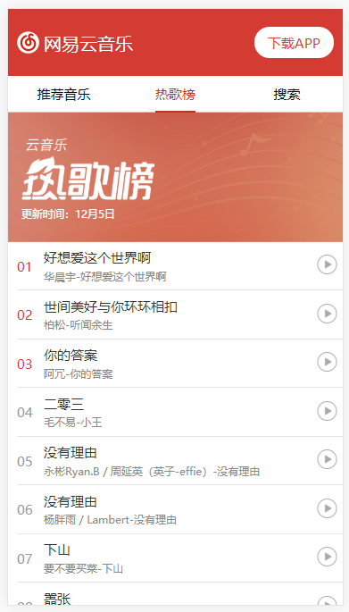
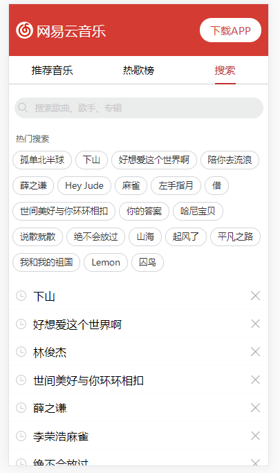
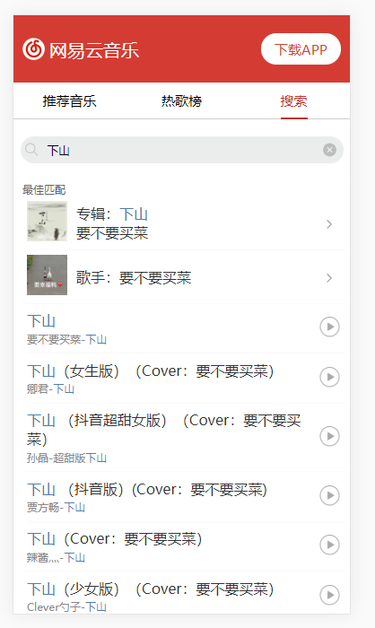
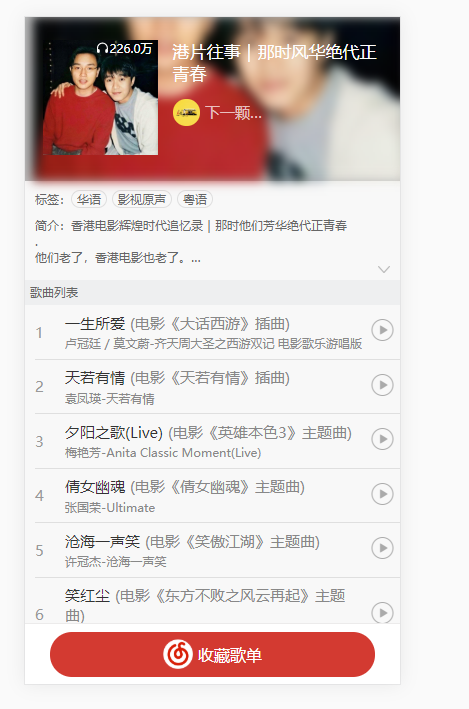
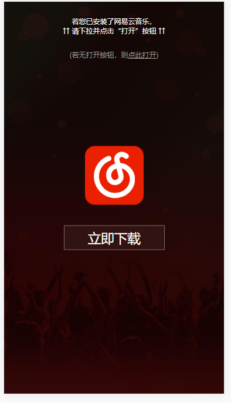
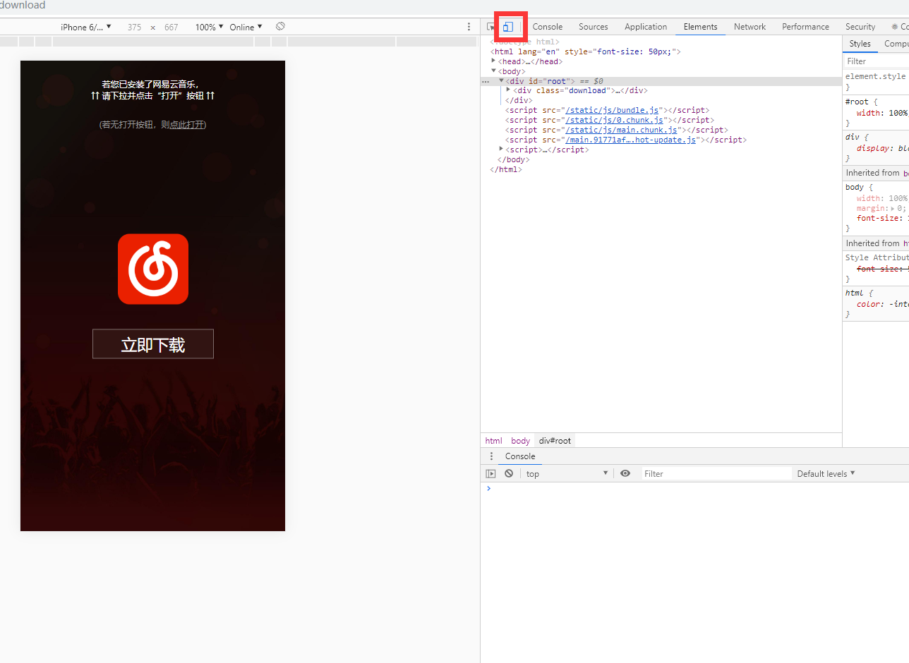

[TOC]

（注：本项目根目录下的img文件夹下的图片仅供git readme展示，与项目无关）

### 1、项目介绍（图片未加载成功，建议翻墙）（也可以查看我的博客 地址为 https://blog.csdn.net/yuanqi3131/article/details/103494761

1）说明：本系统为react+typescript构建移动端网易云音乐

2）所用技术

	react+typescript+axios+sass

3）项目截图

**推荐音乐页面：**


**热歌榜：**



**搜索页面：**





**歌单页面：**



**播放页面**：


**下载页面：**



### 2、运行项目

1）先下载后端项目:  https://github.com/Binaryify/NeteaseCloudMusicApi

然后（后端端口号为4000）

```
$ npm i
$ npm start
```

2）下载本项目

```
$ npm i
$ npm start
```

3）打开网页

```
$ http://localhost:3000/
```

4)因为是移动端的，所以按F12，点击下图所框中的,即可。


